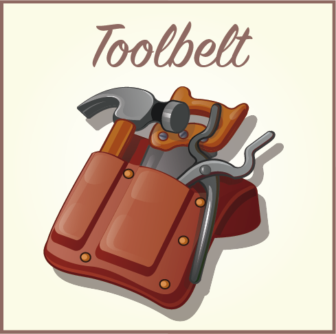

# Toolbelt

*The **Toolbelt** library is just a set of utilities and classes extracted from popular libraries as **Guava, Apache Commons, etc**.*

All this library and idea is inspired on on **Fernando Cejas**'s [Arrow library](https://github.com/android10/arrow).

Why not fork it and make a pull request to Fernando's library? Basically because i added some tools and classes, that i use in my daily work and i think they won't fit well in the original library.

All of 3rd party classes keep the original license header

 

### Main features
- `Optional<T>` extracted from **Guava**
- `MoreObjects` from **Guava**
- `ObjectArrays` from **Guava**
- `Preconditions` from **Guava**
- **Annotations**, some of them migrated from [**Arrow**](https://github.com/android10/arrow) and **Guava**:
    - `@Beta`
    - `@Experimental`
    - `@Issue`
    - `@NeedsTest`
    - `@Refactor`
    - `@VisibleForTesting`
    - `@WorkInProgress`

